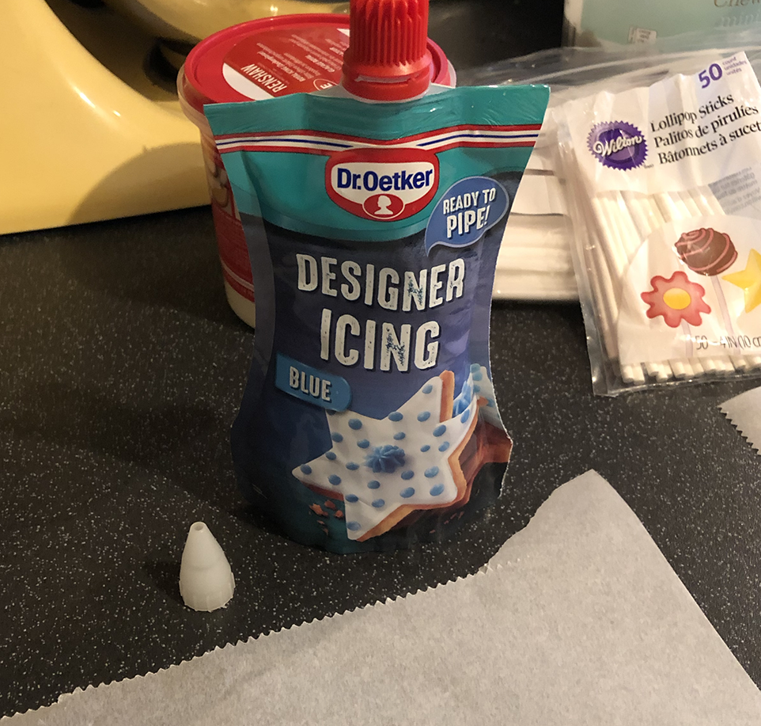

# COVID-19 CAKE

When you look at this visualisation of the COVID-19 virus what do you see?

A pandemic super-bug that will cover every surface of the globe in coughing, wheezing death and decimate the human race.

Or... A delicious fondant covered layer-cake with popcorn candy-pops?

## Construction

I baked 4 cakes in different colours (if the outside is awesome looking the inside should be too!)

Took a shortcut though, used packet mix.

Made some [Cupcake Jemma](https://cupcakejemma.com/) style [buttercream](https://www.youtube.com/watch?v=O4qazwRvO6E)

Trimmed each layer progressively smaller and used buttercream to cement them together. Ate almost an entire cake that I cut away from the top layer!

With the skill of a surgeon and the practiced hand of a sculptor, I shaped the cake into a hemisphere.

Used the remaining buttercream to add a 'crumb coat'. Used that hemisphere cake pan I bought (and failed time after time to bake a decent cake in) as a reference shape.

Refrigerated for at least 30 minutes to set the crumb coat. Maybe enjoy a slice of cold pizza while I wait.

## Decoration

Mixed up another batch of buttercream as above and applied a liberal coating to the cake, then smoothed it out to make a perfect base for the fondant icing. Neglected to take a photograph of this step :|

Got 3 packs of [red Renshaw icing](https://www.lakeland.co.uk/15456/Renshaw-Ready-to-Roll-Coloured-Icing---250g-Red) and smushed them all together, rolled them out to between 3-5mm thick. Following the instructions on this [Cupcake Jemma](https://www.youtube.com/watch?v=z3WKpb_OxA8) video. 

Considered afterwards that maybe 1 pack would have been enough...

Realise I don't care I bought 3 times as much icing as I need because I now have an awesome, red-iced, hemisphere of cake!

To make the [peplomers](https://en.wikipedia.org/wiki/Peplomer) (the pink sticky out bits) I wanted to have the whole thing be edible. I tried using royal icing to glue popcorn onto edible stick treats like Mikado or Pepero before covering them in [pink candy melts](https://www.lakeland.co.uk/62092/PME-Natural-Colour-Candy-Buttons-Pink-200g)...

While the icing did hold the popcorn in place, the whole lot including the chocolate melted off when dunked in the hot candy.

Gave up on the idea of making the whole thing edible and instead used lollipop sticks and attached the candy covered popcorn using more melted candy.

Using a sachet of premixed icing, made the blue blobs by piping the icing onto parchment paper and waiting for it to set (refrigerate).

Picked out the green and yellow balls from my collection of cake sprinkles.

Assembled the component parts. I marked out where I was going to position the candy peplomers, then added the smaller decorations first. Poking indentations in the icing with a metal skewer and adding a tiny bit of food glue helped hold the sprinkles in place. A blob of the blue icing in the indentaions held the blue blobs in place.

The lollipop sticks were a little long for my needs so I trimmed them to length with some side cutters.

## Finished Article

All done!

Sliced and ready to eat.

Nailed that hemisphere, barely any filling in with buttercream 8)

